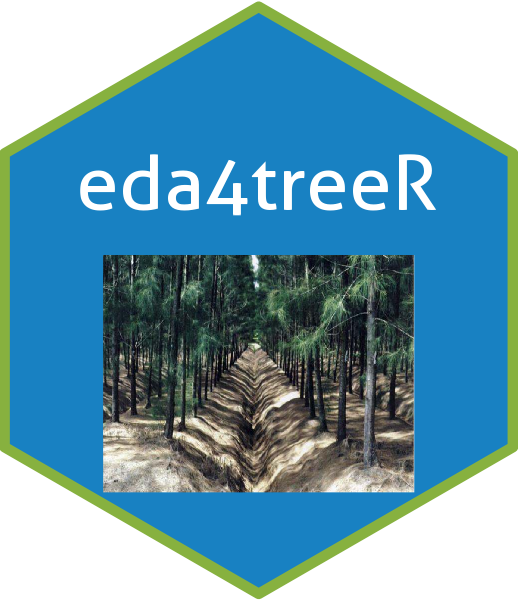

# `eda4treeR`: Experimental Design and Analysis for Tree Improvement 

###### Version : [0.5.0](https://myaseen208.github.io/eda4treeR/); License: [GPL-2\|GPL-3](https://www.r-project.org/Licenses/)

##### *Muhammad Yaseen<sup>1,2,3</sup>, Sami Ullah<sup>4</sup>, Kent M. Eskridge<sup>5</sup>, Emlyn Williams<sup>6</sup>*

1.  Asian Development Bank (ADB), Islamabad, Pakistan.

2.  Benazir Income Support Programme (BISP), Islamabad, Pakistan.

3.  Department of Mathematics and Statistics, University of Agriculture
    Faisalabad, Pakistan.

4.  College of Agriculutre, University of Sargodha, Pakistan.

5.  Department of Statistics, University of Nebraska-Lincoln, Lincoln
    NE, USA

6.  Commonwealth Scientific and Industrial Research Organisation
    (CSIRO), Australia.

------------------------------------------------------------------------

[](https://cran.r-project.org/)
[](https://www.gnu.org/licenses/gpl-3.0)
[](https://cran.r-project.org/package=eda4treeR)
[](https://CRAN.R-project.org/package=eda4treeR)
<!-- [](https://github.com/myaseen208/eda4treeR) -->

[](https://github.com/myaseen208/eda4treeR)

<!-- [] -->

[](https://www.repostatus.org/#inactive)
[](https://www.tidyverse.org/lifecycle/#stable)
[](https://github.com/myaseen208/eda4treeR)


------------------------------------------------------------------------

## Description

Provides data sets and R Codes for E.R. Williams, C.E. Harwood and A.C. Matheson (2023). **Experimental Design and Analysis for Tree
Improvement**, CSIRO Publishing [https://www.publish.csiro.au/book/3145/](https://www.publish.csiro.au/book/3145/).

   

## Installation

The package can be installed from CRAN as follows:

``` r
install.packages("eda4treeR", dependencies = TRUE)
```

 

The development version can be installed from github as follows:

``` r
if (!require("remotes")) install.packages("remotes")
remotes::install_github("myaseen208/eda4treeR")
```

   

## What’s new

To know whats new in this version type:

``` r
news(package = "eda4treeR")
```

## Links

[CRAN page](https://cran.r-project.org/package=eda4treeR)

[Github page](https://github.com/myaseen208/eda4treeR)


[Documentation website](https://myaseen208.github.io/eda4treeR/)

[Companion Website](https://myaseen208.com/EDATR/) 


## Citing `eda4treeR`

To cite the R package `eda4treeR` in publications use:

``` r
citation("eda4treeR")
```


    To cite the R package 'eda4treeR' in publications use:

      Muhammad Yaseen, Sami Ullah, Kent M. Eskridge, and Emlyn Williams
      (2023).  eda4treeR: Experimental Design and Analysis for Tree
      Improvement.R package version 0.5.0 ,
      https://myaseen208.github.io/eda4treeR/https://cran.r-project.org/package=eda4treeR.

    A BibTeX entry for LaTeX users is

      @Manual{,
        title = {eda4treeR: Experimental Design and Analysis for Tree Improvement},
        author = {{Muhammad Yaseen} and {Sami Ullah} and {Kent M. Eskridge} and {Emlyn Williams}},
        year = {2023},
        note = {R package version 0.5.0},
        note = {https://myaseen208.github.io/eda4treeR/ },
        note = {https://cran.r-project.org/package=eda4treeR},
      }

    This free and open-source software implements academic research by the
    authors and co-workers. If you use it, please support the project by
    citing the package.
